# Application Flowchart & Business Process

## 🔄 Complete Application Flow Overview

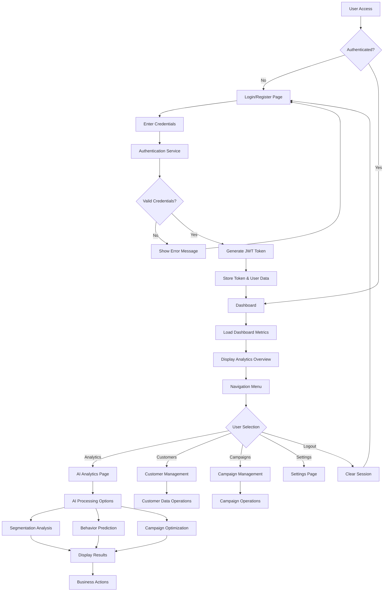

## 🏢 Business Process Flow

### 1. Customer Onboarding & Data Collection

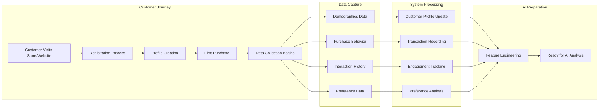

### 2. AI Analytics Processing Workflow

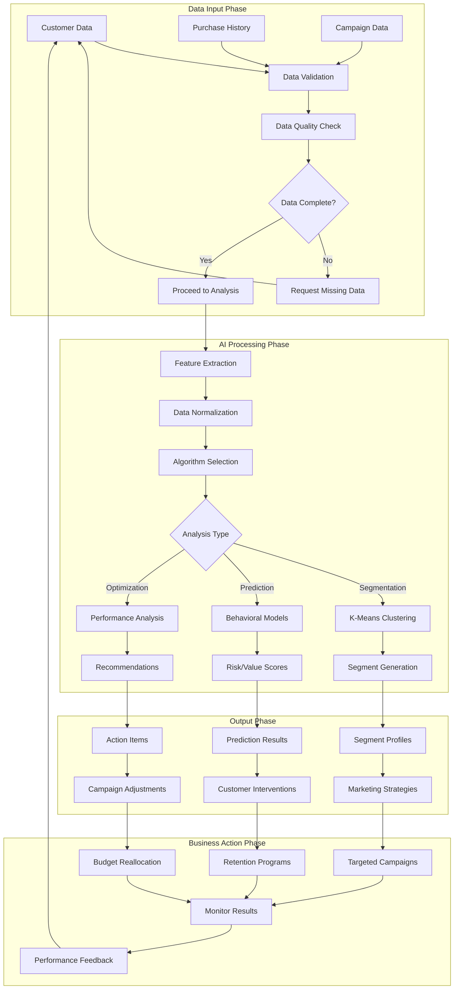

## 📊 Dashboard & Analytics Workflow

### 3. Dashboard Loading Process

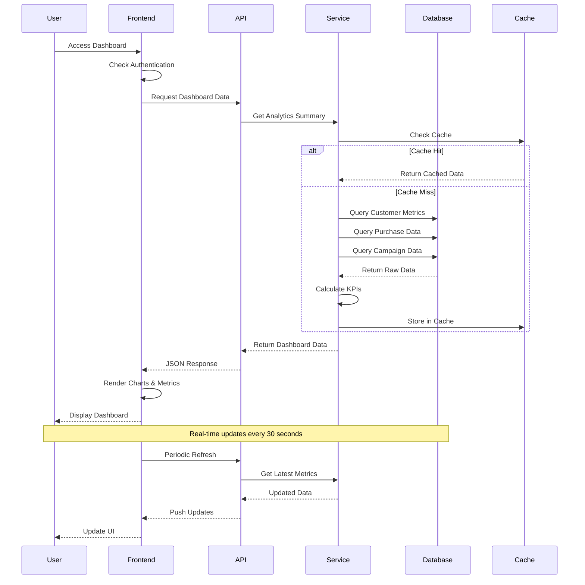

### 4. AI Analytics Execution Flow

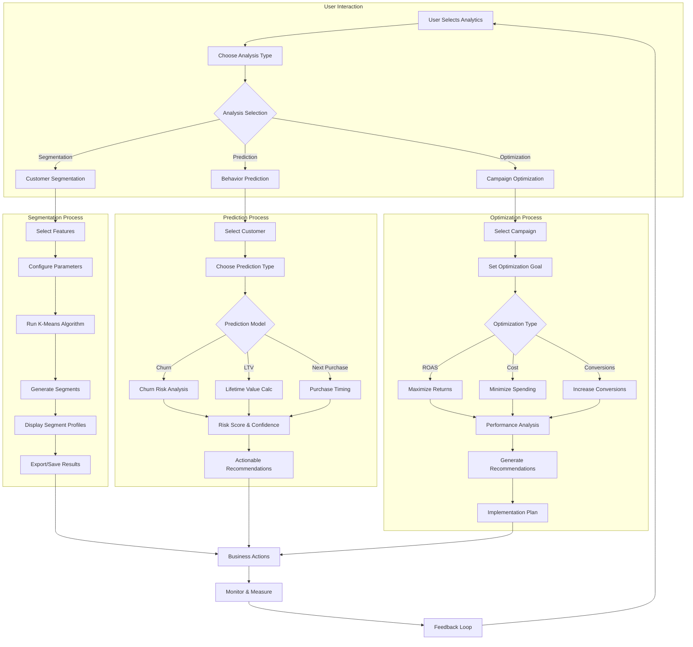

## 🎯 Customer Lifecycle Management Process

### 5. Customer Journey & Touchpoint Management

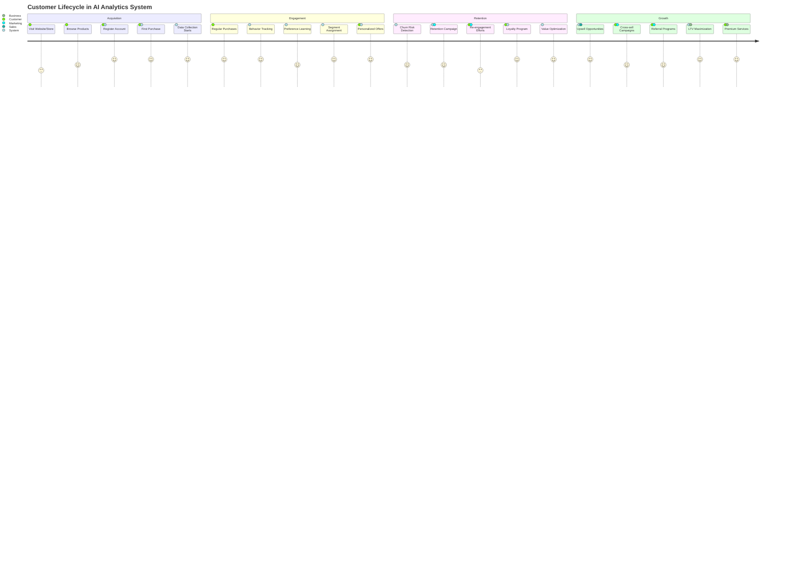

### 6. Marketing Campaign Lifecycle

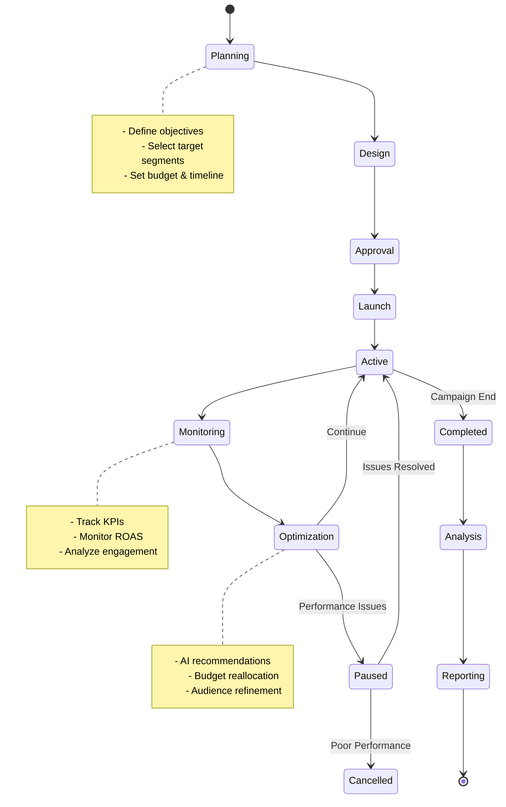

## 🔄 Data Processing & AI Model Training

### 7. Machine Learning Pipeline

```mermaid
flowchart LR
    subgraph "Data Ingestion"
        A[Raw Customer Data] --> B[Data Validation]
        C[Purchase Transactions] --> B
        D[Campaign Interactions] --> B
        B --> E[Data Cleaning]
        E --> F[Data Transformation]
    end
    
    subgraph "Feature Engineering"
        F --> G[RFM Calculation]
        F --> H[Behavioral Metrics]
        F --> I[Demographic Features]
        G --> J[Feature Selection]
        H --> J
        I --> J
        J --> K[Feature Scaling]
    end
    
    subgraph "Model Training"
        K --> L{Model Type}
        L -->|Clustering| M[K-Means Training]
        L -->|Classification| N[Churn Model Training]
        L -->|Regression| O[LTV Model Training]
        
        M --> P[Cluster Validation]
        N --> Q[Model Validation]
        O --> R[Prediction Accuracy]
    end
    
    subgraph "Model Deployment"
        P --> S[Segmentation Service]
        Q --> T[Prediction Service]
        R --> U[Optimization Service]
        
        S --> V[Real-time Inference]
        T --> V
        U --> V
        V --> W[Business Applications]
    end
    
    subgraph "Feedback Loop"
        W --> X[Performance Monitoring]
        X --> Y[Model Drift Detection]
        Y --> Z{Retrain Needed?}
        Z -->|Yes| A
        Z -->|No| X
    end
```

### 8. Real-time Decision Making Process

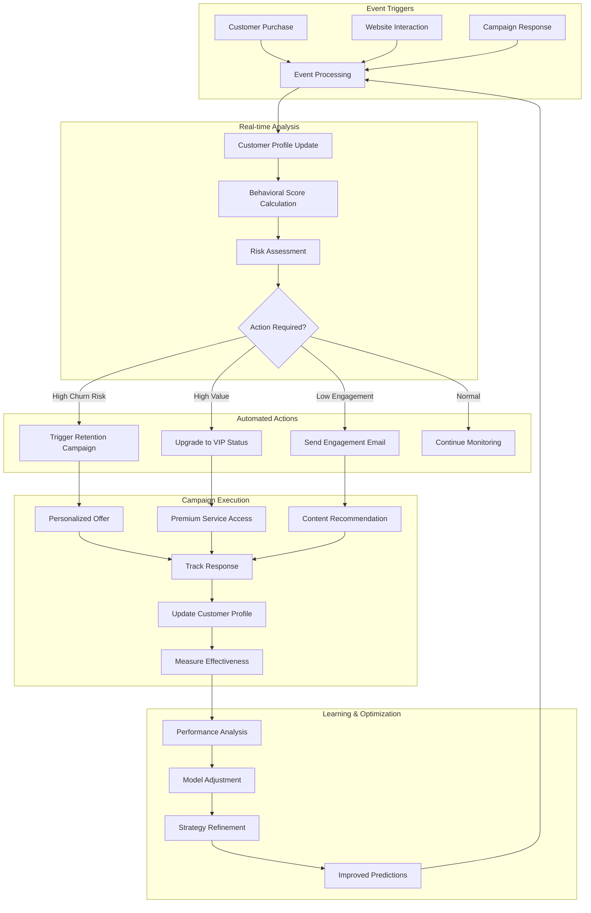

## 📈 Business Intelligence & Reporting

### 9. Executive Dashboard Process

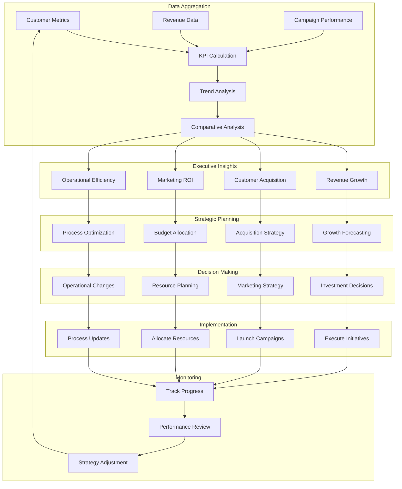

### 10. Operational Workflow

```mermaid
flowchart LR
    subgraph "Daily Operations"
        A[Morning Dashboard Review] --> B[Identify Alerts]
        B --> C[Priority Assessment]
        C --> D[Action Planning]
    end
    
    subgraph "Marketing Team"
        D --> E[Campaign Adjustments]
        E --> F[Audience Refinement]
        F --> G[Creative Optimization]
        G --> H[Budget Reallocation]
    end
    
    subgraph "Sales Team"
        D --> I[Lead Prioritization]
        I --> J[Customer Outreach]
        J --> K[Retention Activities]
        K --> L[Upsell Initiatives]
    end
    
    subgraph "Customer Service"
        D --> M[At-Risk Customer Contact]
        M --> N[Issue Resolution]
        N --> O[Satisfaction Survey]
        O --> P[Feedback Collection]
    end
    
    subgraph "Analytics Team"
        H --> Q[Performance Analysis]
        L --> Q
        P --> Q
        Q --> R[Model Updates]
        R --> S[Insight Generation]
        S --> T[Recommendation Updates]
    end
    
    subgraph "Management Review"
        T --> U[Weekly Performance Review]
        U --> V[Strategy Assessment]
        V --> W[Resource Allocation]
        W --> X[Goal Adjustment]
        X --> A
    end
```

## 🎯 Success Metrics & KPI Tracking

### 11. Performance Measurement Framework

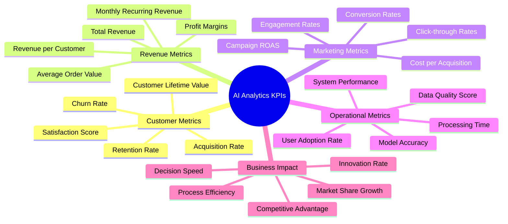

This comprehensive flowchart documentation provides a complete understanding of how the AI Analytics application works from both technical and business perspectives, showing the interconnected processes that drive customer insights and business value.
