# Business Process Flow & Working Procedures

## 🏢 Jumpstart Fashion Retailer - AI Analytics Business Process

### Executive Summary
This document outlines the complete business process flow for Jumpstart's AI Analytics platform, detailing how the system transforms raw customer data into actionable business insights that drive revenue growth and operational efficiency.

## 📋 Business Process Overview

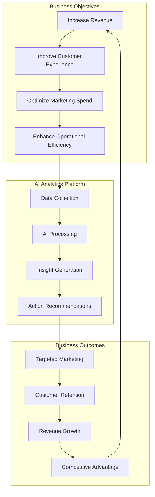

## 🎯 Core Business Processes

### 1. Customer Data Management Process

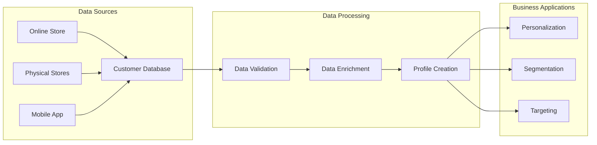

**Process Steps:**
1. **Data Collection**: Capture customer interactions across all touchpoints
2. **Data Validation**: Ensure data quality and completeness
3. **Profile Enhancement**: Enrich profiles with behavioral and preference data
4. **Segmentation**: Group customers based on AI-driven insights
5. **Activation**: Use segments for personalized marketing campaigns

### 2. Marketing Campaign Lifecycle

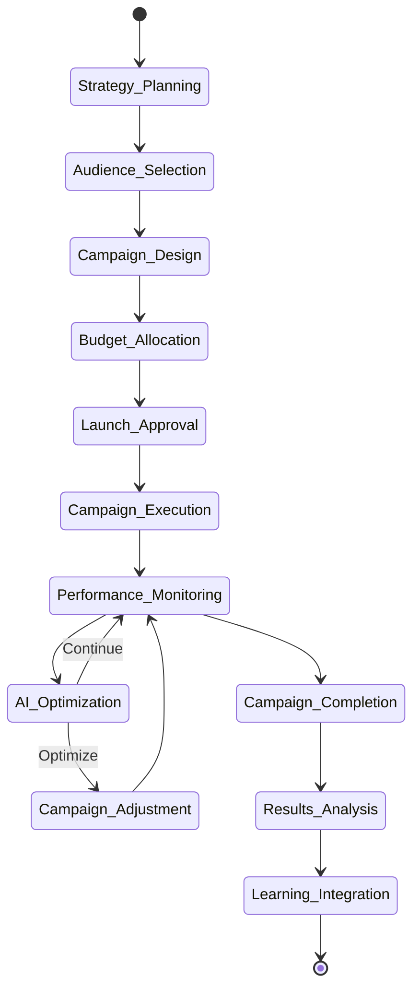

**Key Stakeholders:**
- **Marketing Manager**: Campaign strategy and approval
- **Data Analyst**: Audience selection and performance analysis
- **Creative Team**: Campaign design and content creation
- **AI System**: Automated optimization and recommendations

### 3. Customer Segmentation Business Process

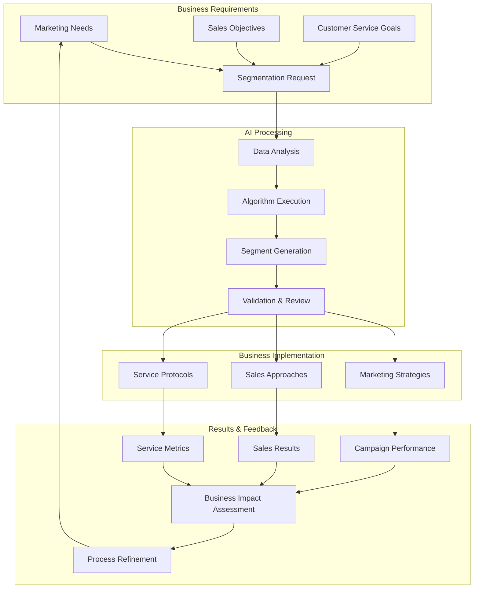

**Segment Types & Business Actions:**

| Segment | Characteristics | Business Strategy | Expected Outcome |
|---------|----------------|-------------------|------------------|
| **High Value** | High spending, frequent purchases | Premium service, exclusive offers | Increased loyalty, higher LTV |
| **Medium Value** | Regular purchases, moderate spending | Targeted promotions, upselling | Segment upgrade, retention |
| **Low Value** | Infrequent, low-value purchases | Cost-effective marketing, activation | Engagement increase, conversion |
| **At-Risk** | Declining activity, churn indicators | Retention campaigns, win-back offers | Churn prevention, re-engagement |
| **New Customers** | Recent registrations, first purchases | Onboarding, education, incentives | Faster activation, loyalty building |

### 4. Predictive Analytics Business Workflow

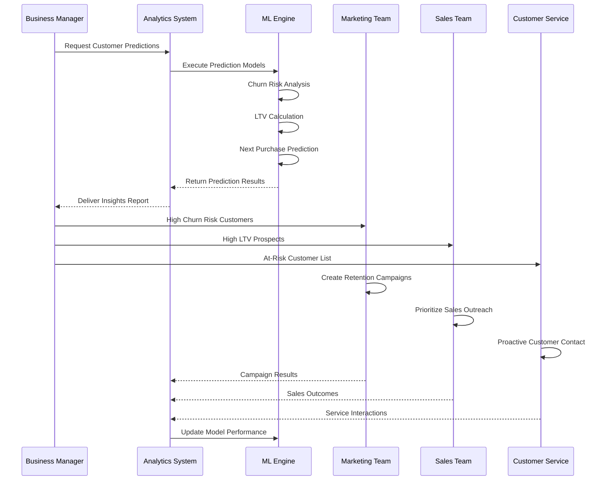

### 5. Campaign Optimization Business Process

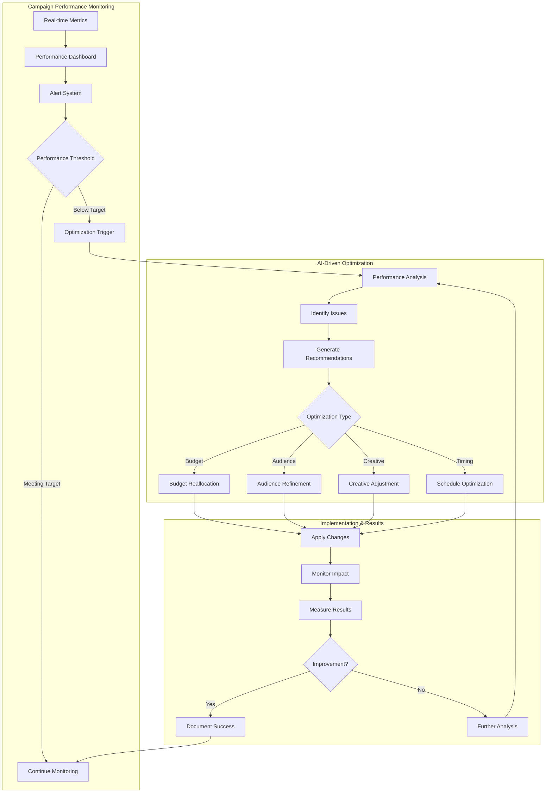

### 6. Daily Operations Workflow

```mermaid
gantt
    title Daily AI Analytics Operations Schedule
    dateFormat HH:mm
    axisFormat %H:%M
    
    section Morning Review
    Dashboard Check     :active, 08:00, 30m
    Alert Assessment    :08:30, 30m
    Priority Setting    :09:00, 30m
    
    section Analysis Phase
    Data Processing     :09:30, 2h
    AI Model Execution  :10:00, 1h
    Results Validation  :11:00, 1h
    
    section Action Phase
    Campaign Adjustments :12:00, 1h
    Customer Outreach   :13:00, 2h
    Performance Tracking :14:00, 1h
    
    section Review Phase
    Results Analysis    :15:00, 1h
    Strategy Planning   :16:00, 1h
    Reporting          :17:00, 1h
```

### 7. Decision-Making Framework

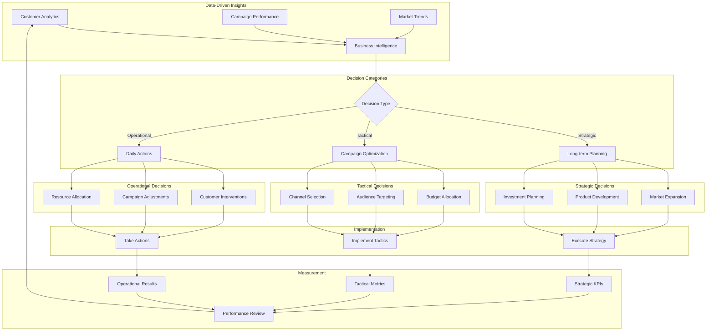

### 8. Customer Journey Management Process

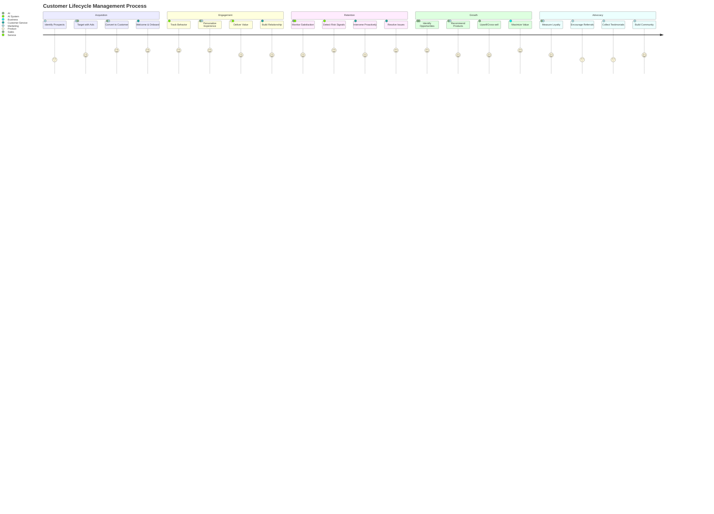

### 9. Performance Management & KPI Tracking

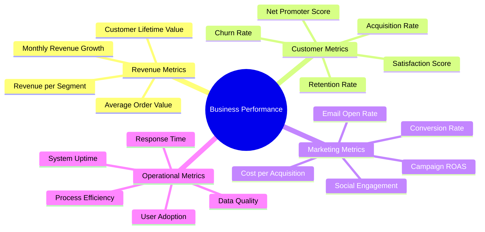

### 10. Risk Management & Compliance

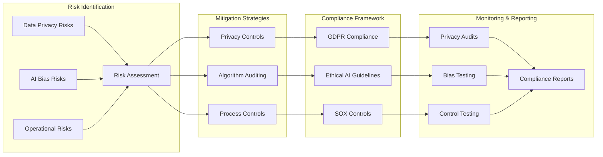

## 📊 Business Value Realization

### ROI Calculation Framework

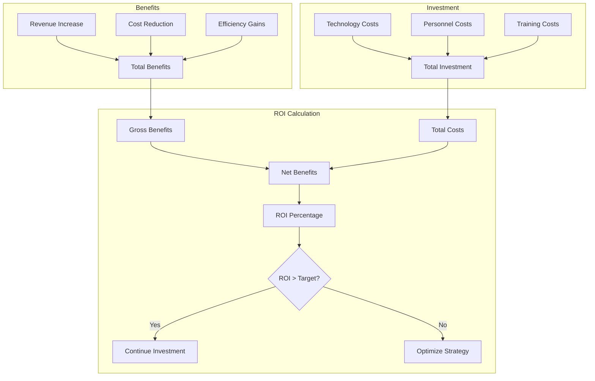

### Success Metrics Dashboard

| Metric Category | KPI | Target | Current | Trend |
|----------------|-----|---------|---------|-------|
| **Revenue** | Monthly Growth | 15% | 18% | ↗️ |
| **Customer** | Retention Rate | 85% | 87% | ↗️ |
| **Marketing** | Campaign ROAS | 4:1 | 4.2:1 | ↗️ |
| **Operational** | Process Efficiency | 90% | 92% | ↗️ |

This comprehensive business process documentation provides Jumpstart with a clear roadmap for implementing and operating their AI Analytics platform, ensuring maximum business value and operational efficiency.
