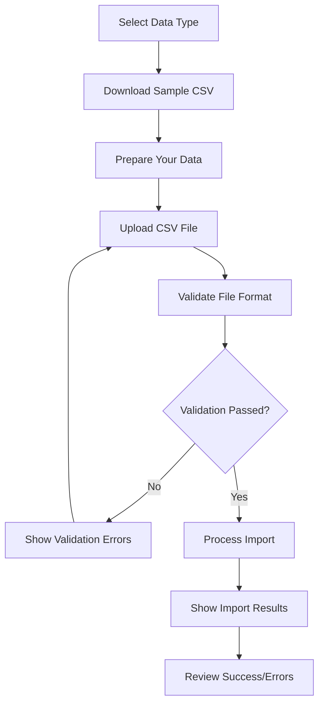

# Data Import Guide

## 📊 Overview

The AI Analytics platform provides comprehensive CSV data import functionality, allowing users to bulk import customer data, purchase history, marketing campaigns, and campaign performance metrics. This feature is essential for migrating existing data and setting up the analytics system with historical information.

## 🚀 Features

### ✅ **What's Included:**
- **CSV File Import**: Support for comma-separated values format
- **Multiple Data Types**: Customers, Purchases, Campaigns, Performance data
- **Sample Files**: Downloadable CSV templates with example data
- **Data Validation**: Comprehensive validation with detailed error reporting
- **Batch Processing**: Handle large datasets efficiently
- **Progress Tracking**: Real-time import status and results
- **Error Handling**: Detailed error messages for failed imports

## 📁 Supported Data Types

### 1. **Customers Import**
Import customer demographic and behavioral data.

**Required Headers:**
```csv
customer_id,age,gender,location,income_range,registration_date,preferred_category
```

**Data Types:**
- `customer_id`: String (unique identifier)
- `age`: Integer (18-100)
- `gender`: String (Male/Female/Other)
- `location`: String (city/state)
- `income_range`: String (e.g., $50k-$75k)
- `registration_date`: Date (YYYY-MM-DD format)
- `preferred_category`: String (product category)

**Example:**
```csv
CUST00001,25,Female,New York,$50k-$75k,2024-01-15,Fashion
```

### 2. **Purchases Import**
Import transaction and purchase history data.

**Required Headers:**
```csv
customer_id,product_id,category,amount,quantity,purchase_date,channel
```

**Data Types:**
- `customer_id`: String (must exist in customers)
- `product_id`: String (product identifier)
- `category`: String (product category)
- `amount`: Decimal (purchase amount)
- `quantity`: Integer (number of items)
- `purchase_date`: Date (YYYY-MM-DD format)
- `channel`: String (online/store)

**Example:**
```csv
CUST00001,PROD001,Fashion,89.99,1,2024-01-20,online
```

### 3. **Campaigns Import**
Import marketing campaign information.

**Required Headers:**
```csv
campaign_id,name,type,target_segment,budget,start_date,end_date,status
```

**Data Types:**
- `campaign_id`: String (unique identifier)
- `name`: String (campaign name)
- `type`: String (email/social/display/search)
- `target_segment`: String (target audience)
- `budget`: Decimal (campaign budget)
- `start_date`: Date (YYYY-MM-DD format)
- `end_date`: Date (YYYY-MM-DD format)
- `status`: String (active/paused/completed)

**Example:**
```csv
CAMP0001,Summer Sale,email,Fashion Lovers,5000.00,2024-06-01,2024-06-30,completed
```

### 4. **Campaign Performance Import**
Import campaign performance metrics and analytics data.

**Required Headers:**
```csv
campaign_id,impressions,clicks,conversions,revenue,cost,date
```

**Data Types:**
- `campaign_id`: String (must exist in campaigns)
- `impressions`: Integer (ad impressions)
- `clicks`: Integer (ad clicks)
- `conversions`: Integer (conversions)
- `revenue`: Decimal (revenue generated)
- `cost`: Decimal (campaign cost)
- `date`: Date (YYYY-MM-DD format)

**Example:**
```csv
CAMP0001,10000,500,25,2500.00,1000.00,2024-06-01
```

## 🔧 API Endpoints

### Import Templates & Samples

#### Get Import Templates
```http
GET /api/v1/import/templates
```

**Response:**
```json
{
  "templates": {
    "customers": {
      "required_headers": ["customer_id", "age", "gender", ...],
      "data_types": {
        "customer_id": "string (unique identifier)",
        "age": "integer (18-100)",
        ...
      },
      "example_row": "CUST00001,25,Female,New York,..."
    }
  },
  "general_guidelines": [
    "CSV files must include headers as the first row",
    "Date format must be YYYY-MM-DD",
    ...
  ]
}
```

#### Download Sample CSV
```http
GET /api/v1/import/sample/{type}
```

**Parameters:**
- `type`: customers | purchases | campaigns | performance

**Response:** CSV file download

### Data Import Endpoints

#### Import Customers
```http
POST /api/v1/impors
Content-Type: multipart/form-data
Authorization: Bearer {token}

file: customers.csv
```

#### Import Purchases
```http
POST /api/v1/import/purchases
Content-Type: multipart/form-data
Authorization: Bearer {token}

file: purchases.csv
```

#### Import Campaigns
```http
POST /api/v1/import/campaigns
Content-Type: multipart/form-data
Authorization: Bearer {token}

file: campaigns.csv
```

#### Import Campaign Performance
```http
POST /api/v1/import/performance
Content-Type: multipart/form-data
Authorization: Bearer {token}

file: performance.csv
```

**Import Response Format:**
```json
{
  "success_count": 8,
  "total_rows": 10,
  "imported": 8,
  "errors": [
    "Row 3: Invalid age: abc",
    "Row 7: Invalid date format (expected YYYY-MM-DD): 2024/01/15"
  ]
}
```

## 💻 Frontend Usage

### Accessing the Import Feature

1. **Navigate to Import Page**: Click "Import Data" in the sidebar navigation
2. **Select Data Type**: Choose from Customers, Purchases, Campaigns, or Performance tabs
3. **Download Sample**: Click "Download Sample CSV" to get the template
4. **Prepare Your Data**: Format your data according to the template
5. **Upload File**: Select your CSV file using the file picker
6. **Import Data**: Click "Import Data" to process the file
7. **Review Results**: Check the import results and any error messages

### Import Process Flow



## 📋 Data Preparation Guidelines

### File Requirements
- **Format**: CSV (Comma-Separated Values) only
- **Size Limit**: Maximum 10MB per file
- **Row Limit**: Maximum 10,000 rows per import
- **Encoding**: UTF-8 encoding recommended

### Data Format Rules
- **Headers**: Must be in the first row, exact case-sensitive match
- **Dates**: Use YYYY-MM-DD format (e.g., 2024-01-15)
- **Decimals**: Use dot (.) as decimal separator (e.g., 123.45)
- **Text Fields**: Avoid commas within text fields
- **Empty Values**: Leave cells empty for optional fields
- **Unique IDs**: Ensure uniqueness where specified

### Common Data Issues

| Issue | Description | Solution |
|-------|-------------|----------|
| **Invalid Headers** | Column headers don't match template | Use exact header names from template |
| **Date Format** | Dates not in YYYY-MM-DD format | Convert dates to YYYY-MM-DD |
| **Decimal Format** | Using comma as decimal separator | Use dot (.) for decimals |
| **Missing Required Fields** | Empty values in required columns | Fill in all required fields |
| **Invalid Data Types** | Text in numeric fields | Ensure correct data types |
| **Duplicate IDs** | Non-unique identifiers | Make IDs unique |

## 🔍 Validation & Error Handling

### Validation Process

1. **File Format Check**: Verify CSV format and file extension
2. **Header Validation**: Ensure all required headers are present
3. **Data Type Validation**: Check each field matches expected type
4. **Business Rule Validation**: Verify relationships and constraints
5. **Duplicate Detection**: Check for duplicate identifiers

### Error Types

#### File-Level Errors
- Invalid file format (not CSV)
- File too large (>10MB)
- Too many rows (>10,000)
- Missing or invalid headers

#### Row-Level Errors
- Invalid data types (text in numeric fields)
- Invalid date formats
- Missing required fields
- Invalid enum values
- Duplicate identifiers

#### Relationship Errors
- Customer ID not found (for purchases)
- Campaign ID not found (for performance data)
- Invalid foreign key references

### Error Response Example
```json
{
  "success_count": 7,
  "total_rows": 10,
  "imported": 7,
  "errors": [
    "Row 2: Invalid age: must be between 18 and 100",
    "Row 5: Invalid date format (expected YYYY-MM-DD): 01/15/2024",
    "Row 8: Customer ID 'CUST99999' not found"
  ]
}
```

## 🎯 Best Practices

### Data Preparation
1. **Start Small**: Test with a small sample file first
2. **Use Templates**: Always download and use the provided templates
3. **Validate Data**: Check your data before importing
4. **Backup**: Keep backups of your original data
5. **Clean Data**: Remove duplicates and invalid entries

### Import Strategy
1. **Import Order**: Import customers first, then purchases, campaigns, and performance
2. **Batch Processing**: Split large datasets into smaller batches
3. **Error Review**: Always review and fix errors before re-importing
4. **Incremental Updates**: Use imports for initial setup, then use regular data entry

### Performance Optimization
1. **File Size**: Keep files under 5MB for optimal performance
2. **Row Count**: Limit to 5,000 rows per import for best results
3. **Network**: Use stable internet connection for large imports
4. **Browser**: Use modern browsers for better performance

## 🔧 Troubleshooting

### Common Issues & Solutions

#### Import Fails Immediately
- **Check File Format**: Ensure file is CSV format
- **Verify Headers**: Headers must match exactly
- **File Size**: Ensure file is under 10MB
- **Authentication**: Verify you're logged in

#### Partial Import Success
- **Review Errors**: Check error messages for specific issues
- **Fix Data**: Correct the problematic rows
- **Re-import**: Import only the failed rows

#### Performance Issues
- **Reduce File Size**: Split large files into smaller batches
- **Check Network**: Ensure stable internet connection
- **Browser Memory**: Close other tabs/applications

#### Data Not Appearing
- **Refresh Dashboard**: Data may need time to process
- **Check Filters**: Verify dashboard filters aren't hiding data
- **Verify Import**: Confirm import was successful

### Support & Help

For additional support:
1. **Check Error Messages**: Review detailed error messages
2. **Download Samples**: Use provided sample files as reference
3. **Test Small Batches**: Start with small test imports
4. **Contact Support**: Reach out for complex data migration needs

## 📈 Business Impact

### Benefits of Data Import
- **Quick Setup**: Rapidly populate the system with historical data
- **Data Migration**: Seamlessly migrate from existing systems
- **Bulk Operations**: Efficiently handle large datasets
- **Time Savings**: Avoid manual data entry
- **Data Consistency**: Ensure standardized data format

### Use Cases
- **System Migration**: Moving from legacy systems
- **Historical Analysis**: Importing past customer and sales data
- **Campaign Data**: Bulk import of marketing campaign results
- **Data Integration**: Combining data from multiple sources

This comprehensive data import system enables Jumpstart to quickly populate their AI Analytics platform with existing data, ensuring immediate value and insights from day one.
