# System Flow Diagrams & Visual Architecture

## 🔄 Complete System Flow Overview

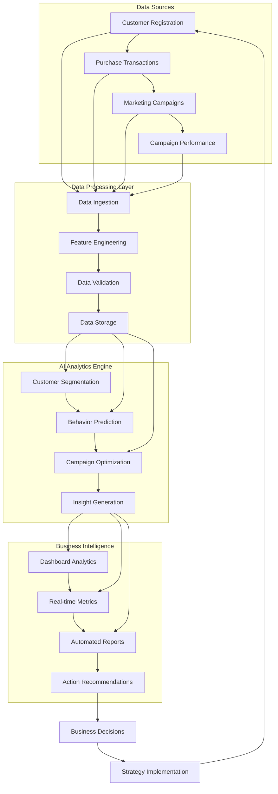

## 📊 Data Model Relationships

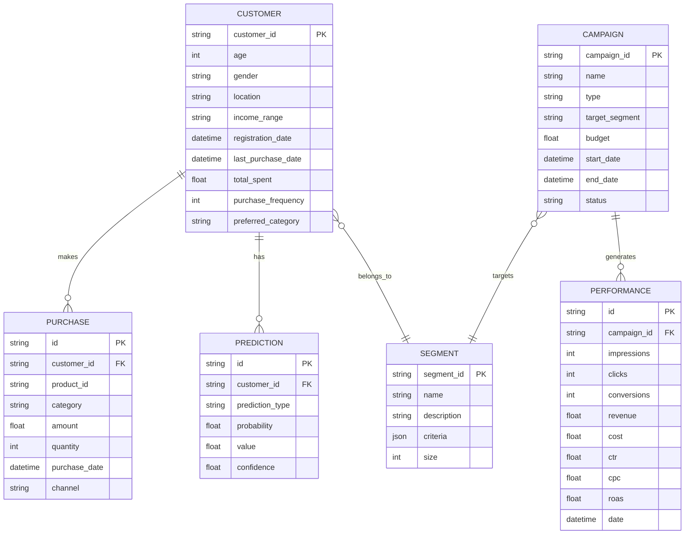

## 🤖 AI Analytics Processing Flow

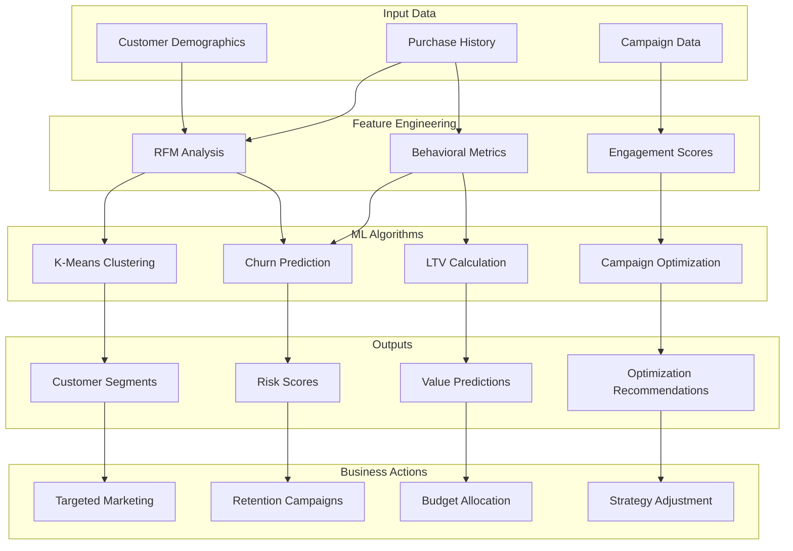

## 🎯 Customer Segmentation Flow

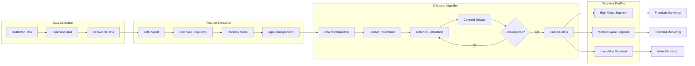

## 🔮 Prediction Model Flow

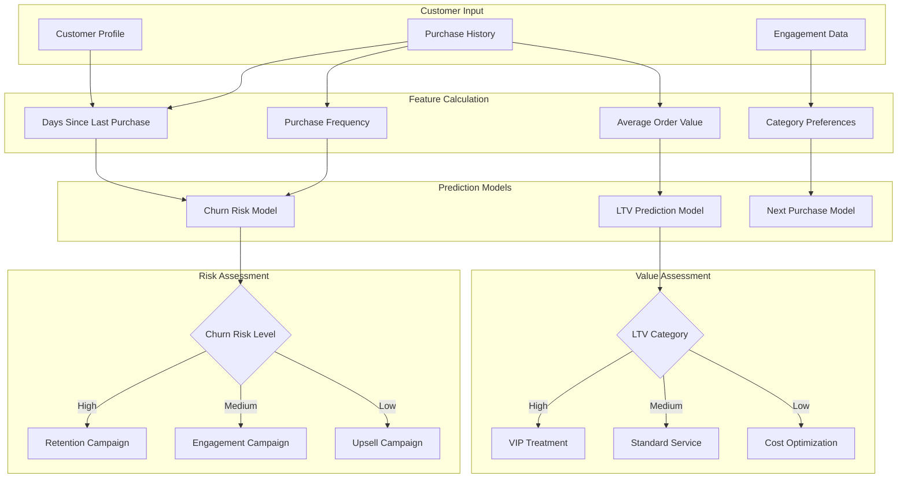

## 📈 Campaign Optimization Flow

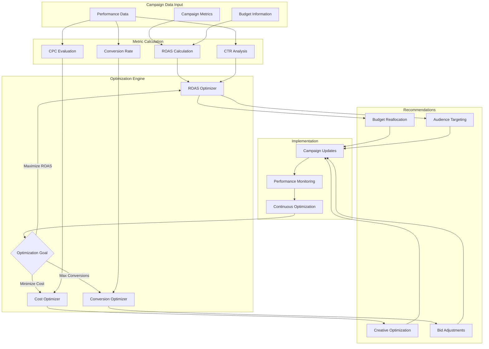

## 🌐 API Request Flow

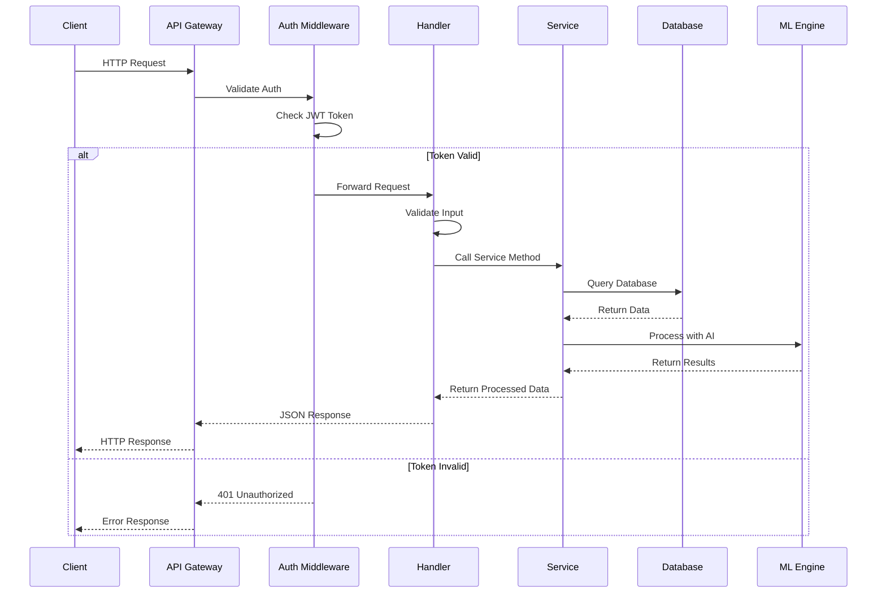

## 🔄 Real-time Data Processing

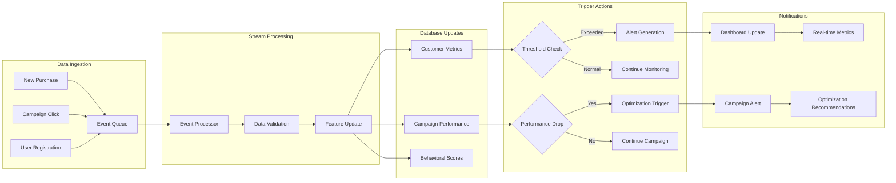

## 📱 Frontend Component Flow

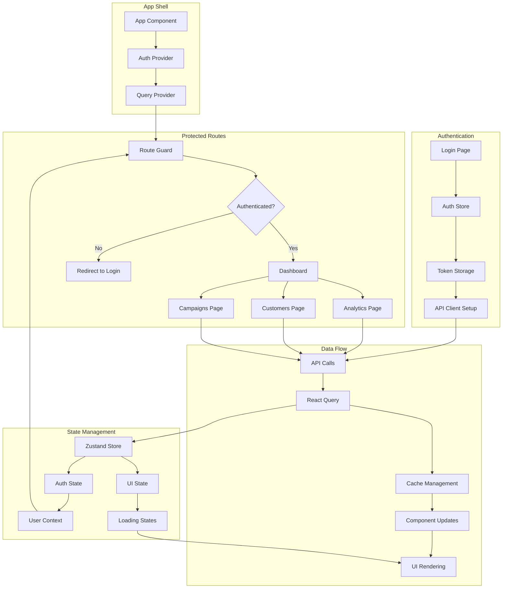

## 🎨 User Experience Flow

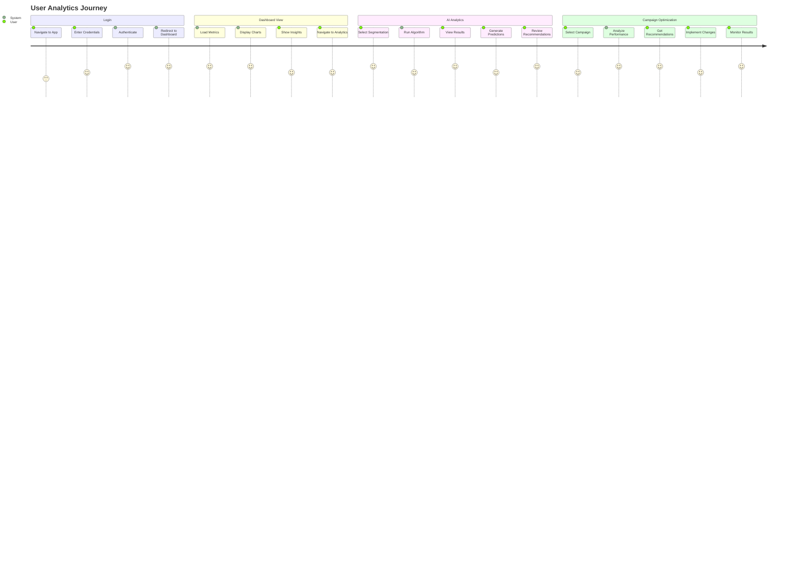

## 🔧 Development Workflow

```mermaid
gitgraph
    commit id: "Initial Setup"
    branch feature/auth
    checkout feature/auth
    commit id: "Add Authentication"
    commit id: "JWT Implementation"
    checkout main
    merge feature/auth
    
    branch feature/analytics
    checkout feature/analytics
    commit id: "Customer Models"
    commit id: "Segmentation Algorithm"
    commit id: "Prediction Models"
    checkout main
    merge feature/analytics
    
    branch feature/frontend
    checkout feature/frontend
    commit id: "Dashboard Components"
    commit id: "Analytics UI"
    commit id: "Charts Integration"
    checkout main
    merge feature/frontend
    
    commit id: "Production Deploy"
```

## 📊 Performance Monitoring Flow

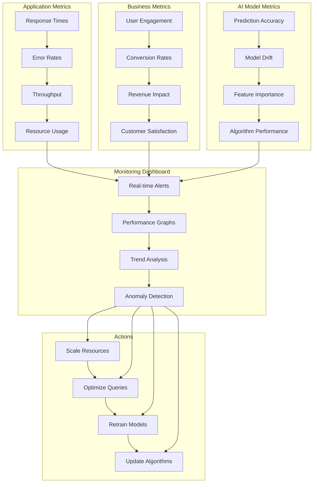

These visual diagrams provide a comprehensive understanding of how all components in the AI Analytics system work together, from data ingestion through AI processing to business insights and actions. Each flow shows the relationships, dependencies, and data transformations that occur throughout the system.
