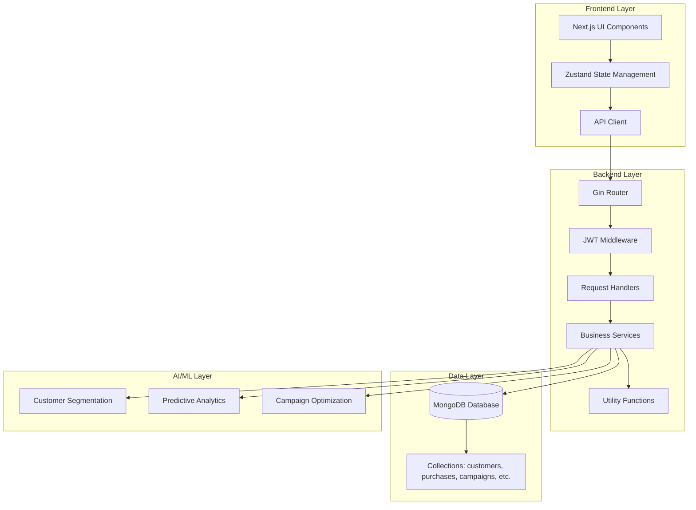
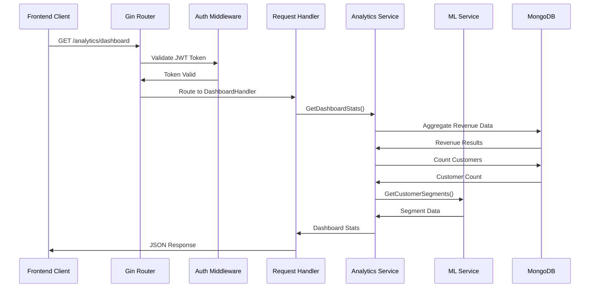
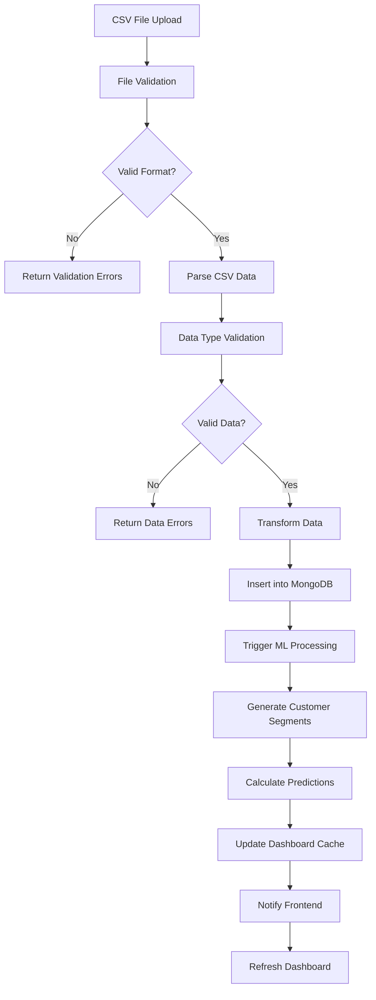
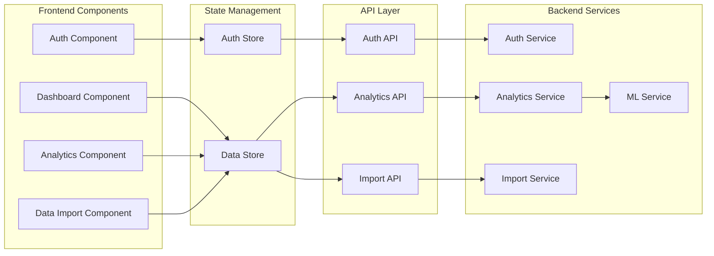
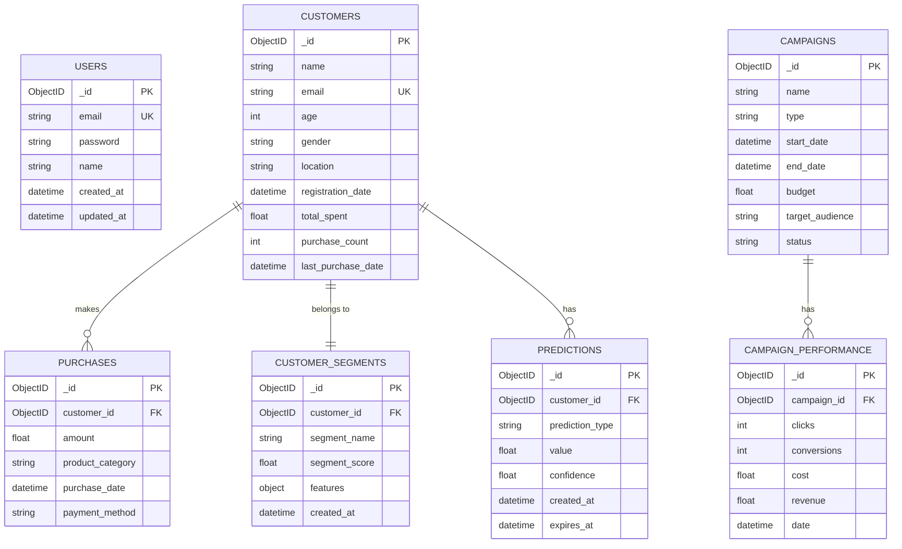
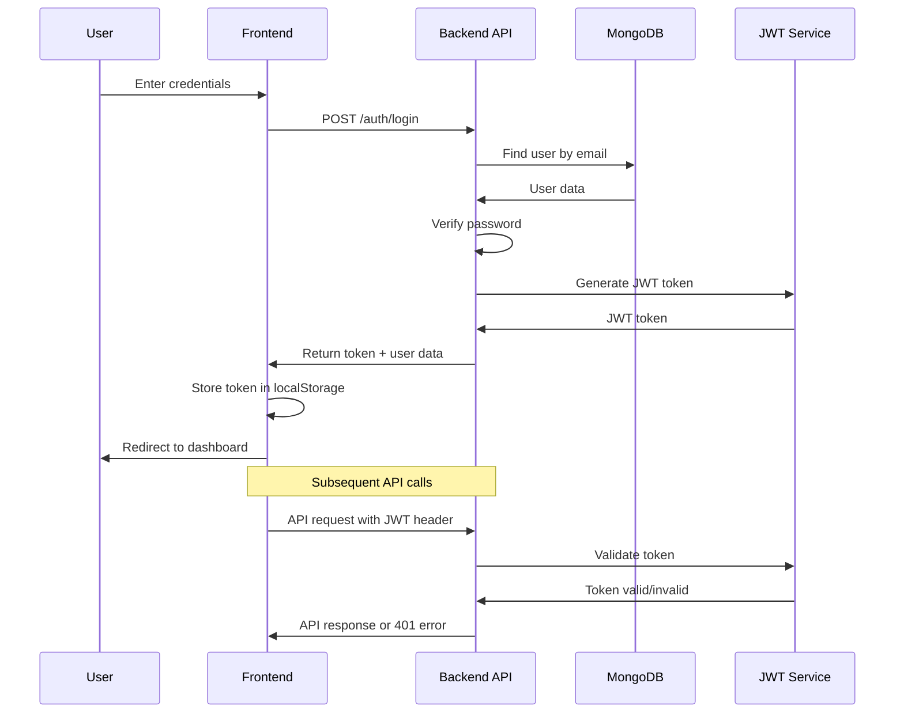
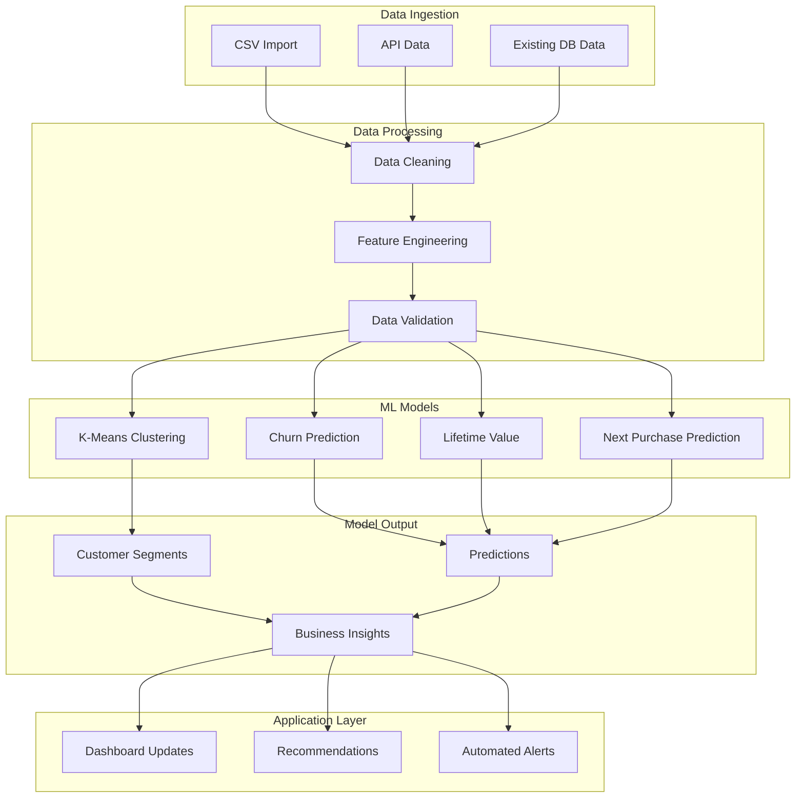
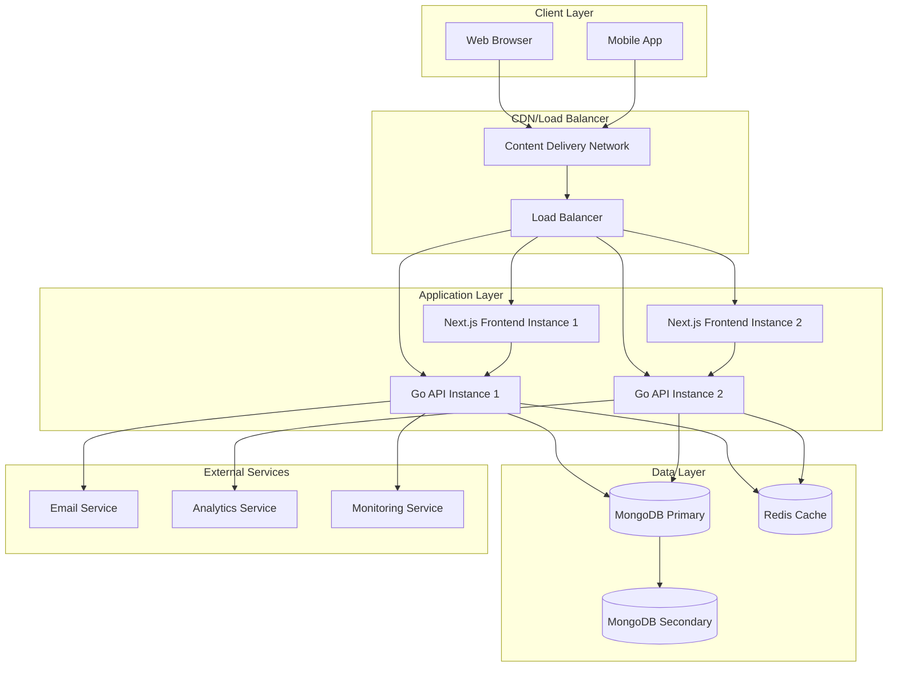

# UML Diagrams - AI Analytics Platform

## 1. System Architecture Diagram



## 2. Class Diagram - Core Models

```mermaid
classDiagram
    class User {
        +ID ObjectID
        +Email string
        +Password string
        +Name string
        +CreatedAt time.Time
        +UpdatedAt time.Time
        +Validate() error
        +HashPassword() error
        +CheckPassword(password string) bool
    }
    
    class Customer {
        +ID ObjectID
        +Name string
        +Email string
        +Age int
        +Gender string
        +Location string
        +RegistrationDate time.Time
        +TotalSpent float64
        +PurchaseCount int
        +LastPurchaseDate time.Time
        +Validate() error
    }
    
    class Purchase {
        +ID ObjectID
        +CustomerID ObjectID
        +Amount float64
        +ProductCategory string
        +PurchaseDate time.Time
        +PaymentMethod string
        +Validate() error
    }
    
    class Campaign {
        +ID ObjectID
        +Name string
        +Type string
        +StartDate time.Time
        +EndDate time.Time
        +Budget float64
        +TargetAudience string
        +Status string
        +Validate() error
    }
    
    class CampaignPerformance {
        +ID ObjectID
        +CampaignID ObjectID
        +Clicks int
        +Conversions int
        +Cost float64
        +Revenue float64
        +Date time.Time
        +Validate() error
    }
    
    class CustomerSegment {
        +ID ObjectID
        +CustomerID ObjectID
        +SegmentName string
        +SegmentScore float64
        +Features map[string]float64
        +CreatedAt time.Time
        +Validate() error
    }
    
    class Prediction {
        +ID ObjectID
        +CustomerID ObjectID
        +PredictionType string
        +Value float64
        +Confidence float64
        +CreatedAt time.Time
        +ExpiresAt time.Time
        +Validate() error
    }
    
    Customer ||--o{ Purchase : "has many"
    Campaign ||--o{ CampaignPerformance : "has many"
    Customer ||--|| CustomerSegment : "belongs to"
    Customer ||--o{ Prediction : s many"
```

## 3. Service Layer Architecture

```mermaid
classDiagram
    class AnalyticsService {
        +db *mongo.Database
        +GetDashboardStats() DashboardStats
        +GetRevenueTrend() []RevenueData
        +GetCustomerGrowth() []CustomerGrowthData
        +GetCustomerSegmentDistribution() []SegmentData
        +GetCampaignPerformanceData() []CampaignData
        +GenerateCustomerSegments() error
        +PredictChurn(customerID string) ChurnPrediction
        +PredictLifetimeValue(customerID string) LTVPrediction
        +PredictNextPurchase(customerID string) NextPurchasePrediction
        +OptimizeROAS() ROASOptimization
        +MinimizeCosts() CostOptimization
        +MaximizeConversions() ConversionOptimization
    }
    
    class ImportService {
        +db *mongo.Database
        +ImportCustomers(data []Customer) ImportResult
        +ImportPurchases(data []Purchase) ImportResult
        +ImportCampaigns(data []Campaign) ImportResult
        +ImportCampaignPerformance(data []CampaignPerformance) ImportResult
        +ValidateData(data interface{}) []ValidationError
        +GenerateSampleData() SampleData
    }
    
    class AuthService {
        +db *mongo.Database
        +jwtSecret string
        +Register(user User) error
        +Login(email, password string) (string, error)
        +ValidateToken(token string) (*User, error)
        +RefreshToken(token string) (string, error)
    }
    
    class MLService {
        +PerformKMeansClustering(customers []Customer) []CustomerSegment
        +CalculateChurnProbability(customer Customer) float64
        +CalculateLifetimeValue(customer Customer) float64
        +PredictNextPurchaseDate(customer Customer) time.Time
        +AnalyzeCampaignPerformance(campaigns []Campaign) CampaignAnalysis
    }
    
    AnalyticsService --> MLService : uses
    AnalyticsService --> ImportService : collaborates
    AuthService --> User : manages
```

## 4. API Endpoints Sequence Diagram



## 5. Data Flow Diagram



## 6. Component Interaction Diagram



## 7. Database Schema Diagram



## 8. Authentication Flow Diagram



## 9. ML Pipeline Architecture



## 10. Deployment Architecture



These UML diagrams provide a comprehensive view of the AI Analytics Platform architecture, covering:

1. **System Architecture**: High-level system components and their relationships
2. **Class Diagram**: Core data models and their relationships
3. **Service Layer**: Business logic organization and dependencies
4. **API Sequence**: Request/response flow through the system
5. **Data Flow**: How data moves through the import and processing pipeline
6. **Component Interaction**: Frontend component relationships and data flow
7. **Database Schema**: Entity relationships and data structure
8. **Authentication Flow**: Security and user management process
9. **ML Pipeline**: Machine learning data processing and model execution
10. **Deployment Architecture**: Production deployment structure and scaling

These diagrams serve as both documentation and architectural reference for the entire platform! 🏗️
