# User Interaction Flow & System Navigation

## 👥 User Roles & System Interactions

### User Role Overview

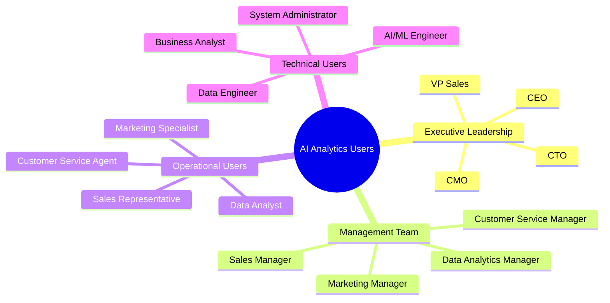

## 🔄 Complete User Journey Flow

### 1. System Access & Authentication Flow

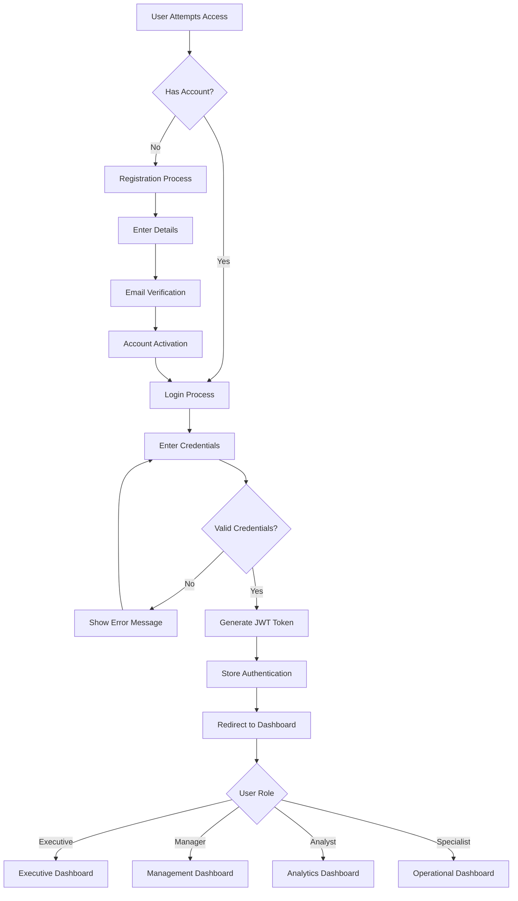

### 2. Executive User Flow

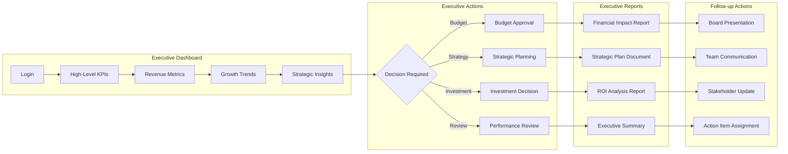

### 3. Marketing Manager User Flow

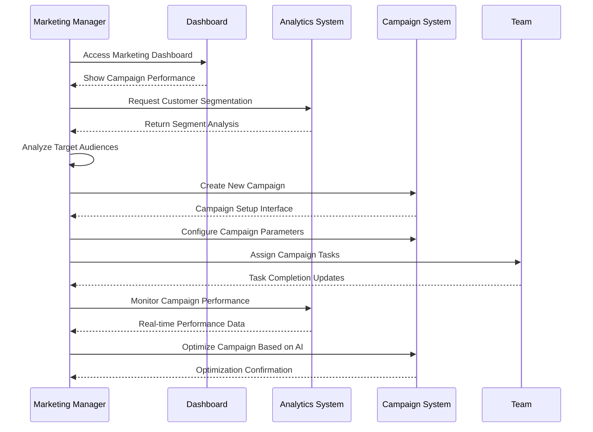

### 4. Data Analyst User Flow

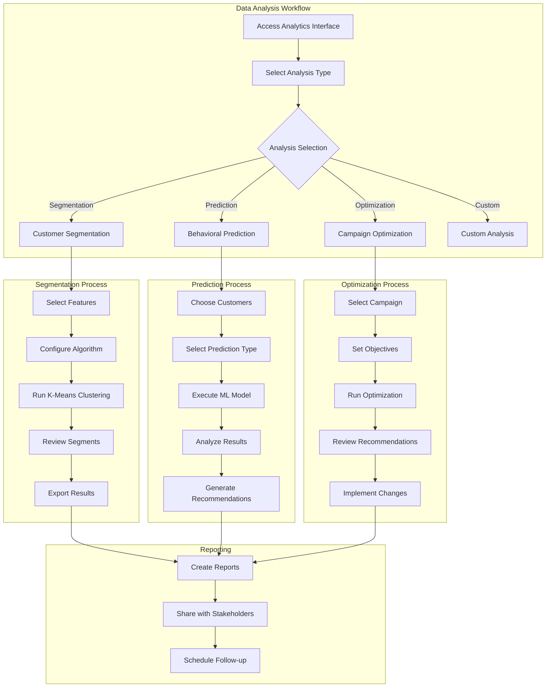

### 5. Customer Service Representative Flow

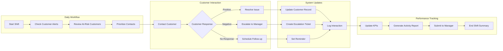

## 📱 User Interface Navigation Flow

### 6. Dashboard Navigation Structure

```mermaid
flowchart TD
    subgraph "Main Navigation"
        A[Dashboard Home] --> B[Analytics]
        A --> C[Customers]
        A --> D[Campaigns]
        A --> E[Reports]
        A --> F[Settings]
    end
    
    subgraph "Analytics Section"
        B --> G[Customer Segmentation]
        B --> H[Behavior Prediction]
        B --> I[Campaign Optimization]
        B --> J[Custom Analysis]
    end
    
    subgraph "Customer Section"
        C --> K[Customer List]
        C --> L[Customer Profiles]
        C --> M[Segment Management]
        C --> N[Customer Journey]
    end
    
    subgraph "Campaign Section"
        D --> O[Active Campaigns]
        D --> P[Campaign Performance]
        D --> Q[Campaign Builder]
        D --> R[Campaign History]
    end
    
    subgraph "Reports Section"
        E --> S[Executive Reports]
        E --> T[Performance Reports]
        E --> U[Custom Reports]
        E --> V[Scheduled Reports]
    end
```

### 7. Mobile User Experience Flow

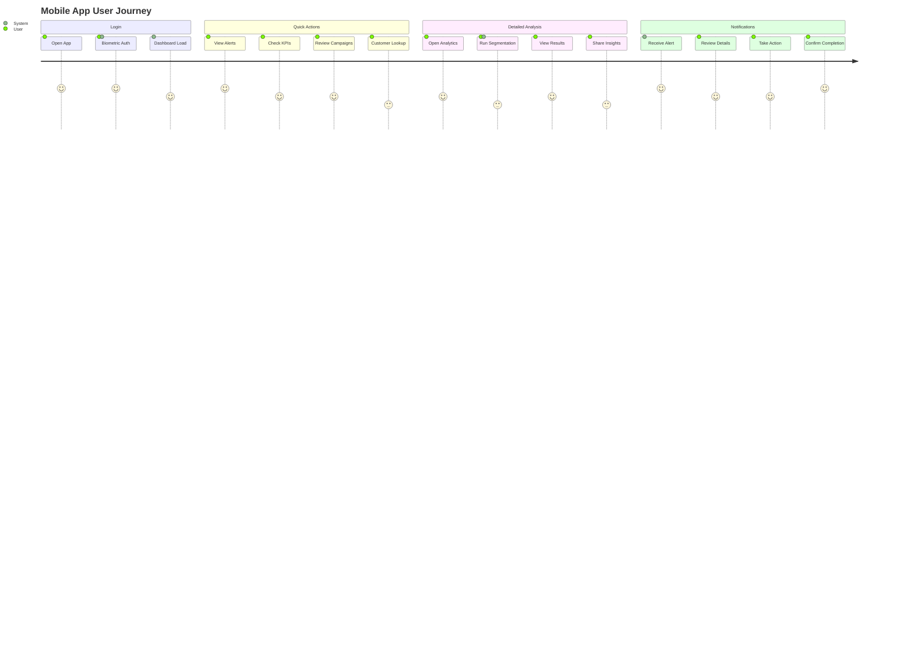

### 8. Collaborative Workflow

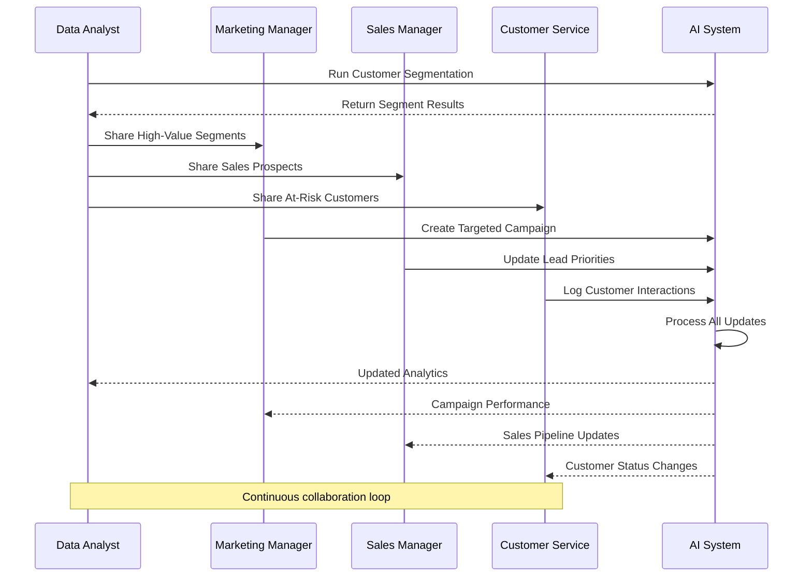

## 🎯 Task-Specific User Flows

### 9. Campaign Creation Workflow

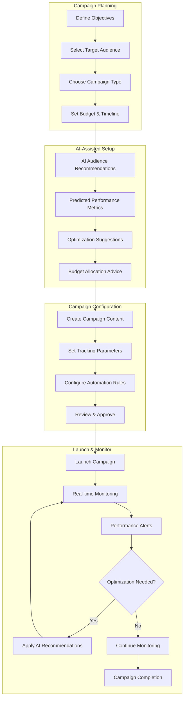

### 10. Customer Analysis Workflow

```mermaid
flowchart LR
    subgraph "Customer Selection"
        A[Search Customers] --> B[Apply Filters]
        B --> C[Select Customer(s)]
        C --> D[View Profile]
    end
    
    subgraph "Analysis Options"
        D --> E{Analysis Type}
        E -->|Individual| F[Customer Deep Dive]
        E -->|Comparative| G[Segment Comparison]
        E -->|Predictive| H[Behavior Prediction]
        E -->|Journey| I[Customer Journey Map]
    end
    
    subgraph "Insights Generation"
        F --> J[Purchase History Analysis]
        G --> K[Segment Performance]
        H --> L[Risk/Value Scores]
        I --> M[Touchpoint Analysis]
    end
    
    subgraph "Action Planning"
        J --> N[Personalization Strategy]
        K --> O[Segment Optimization]
        L --> P[Intervention Planning]
        M --> Q[Journey Optimization]
    end
    
    subgraph "Implementation"
        N --> R[Execute Actions]
        O --> R
        P --> R
        Q --> R
        R --> S[Track Results]
        S --> T[Measure Impact]
    end
```

### 11. Error Handling & Support Flow

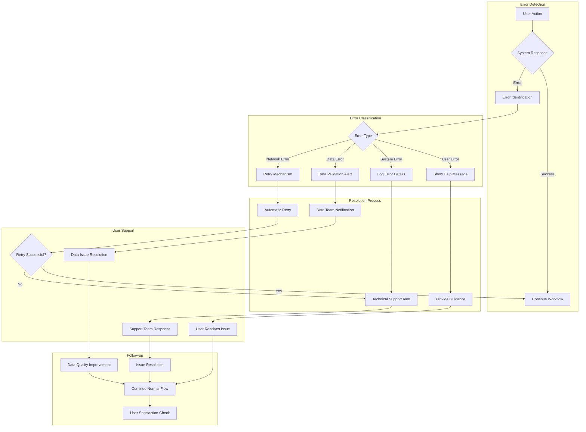

### 12. Performance Optimization User Flow

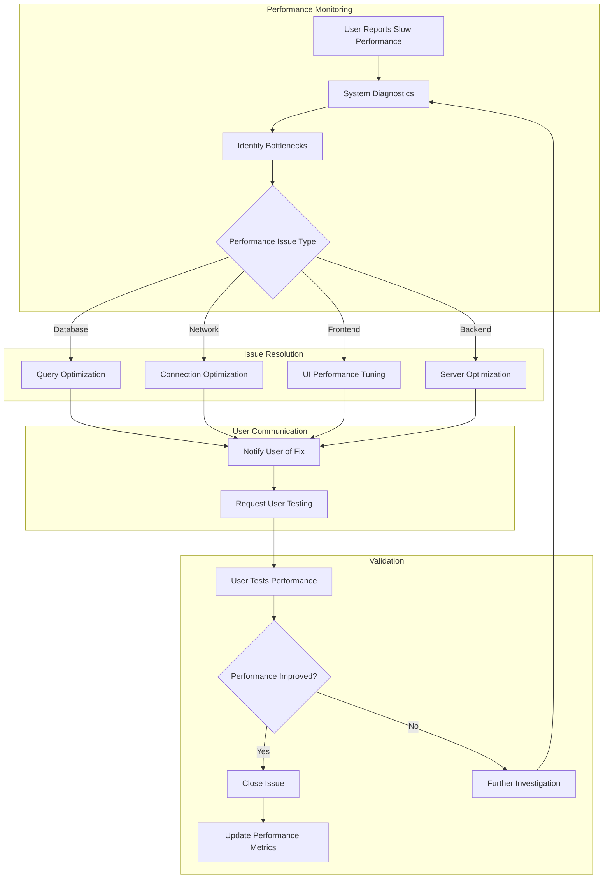

This comprehensive user interaction flow documentation provides a complete understanding of how different users navigate and interact with the AI Analytics system, ensuring optimal user experience and efficient business processes.
